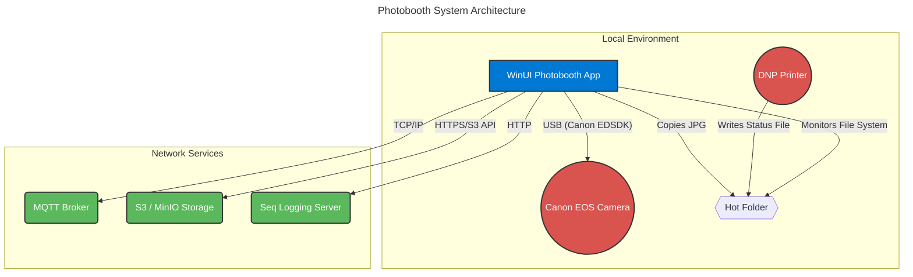

# WinUI3App1

WinUI3App1 is a photo booth app built in .NET 8 for WinUI3. The project leverages the Canon EDSDK (Canon SDK) for camera 
integration and Config.Net for flexible configuration management.

## Tech Stack

- **.NET 8**
- **WinUI 3** (Windows App SDK)
- **Canon SDK (EDSDK)** for camera control and image capture
- **Config.Net** for configuration handling  (https://github.com/aloneguid/config)
- **MQTT** for 
	- controlling external hardware (e.g., LED lights via ESPHome)  (see [videobooth-hardware](https://github.com/dschoorisse/videobooth-hardware))
	- communiction to central server (e.g., for remote monitoring or control)
- **Serilog** for logging and diagnostics
- **DNP HotFolder Utility** for automatic printing of images to DNP printers

## Usage

This application allows users to connect to and control Canon cameras, capture images, and manage camera settings directly from a modern Windows 
desktop interface. Configuration options are managed via Config.Net, enabling easy customization of application settings.

## How It Works

1. The app initializes the Canon SDK to detect and communicate with connected Canon cameras.
2. Users can interact with the camera (e.g., capture images, change settings) through the WinUI 3 interface.
3. Application settings are loaded and saved using Config.Net, allowing for persistent and flexible configuration.

## External Hardware

This application is designed to work with the following external hardware components:

- **DNP Printer (via HotFolder Utility):**  
  The app can output images to a designated "hot folder" monitored by the DNP HotFolder utility, enabling automatic printing of captured images on a DNP photo printer.

- **LED Lights (MQTT, ESPHome):**  
  LED lighting is controlled over MQTT using an ESPHome device. The ESPHome firmware (see [videobooth-hardware](https://github.com/dschoorisse/videobooth-hardware)) allows 
- the app to send MQTT messages to adjust lighting conditions during photo capture.

- **Canon Camera (EDSDK):**  
  Camera control and image capture are handled through the Canon EDSDK, providing direct integration with supported Canon cameras for high-quality image acquisition.

### Camera

#### Canon Camera Usage

For this project, Canon mirrorless cameras are used for high-quality image capture and reliable remote control via the Canon EDSDK. 
After evaluating several model specifications, the Canon EOS R50 and EOS R100 were considered. Based on the requirements for autofocus 
performance, video capabilities, and power options, the Canon EOS R50 is the preferred choice.

Below is a direct comparison of the two models:

| Feature      | Canon EOS R50 | Canon EOS R100 | Winner   |
|--------------|---------------|---------------|----------|
| **Autofocus** | Dual Pixel CMOS AF II: Advanced system with more AF points and superior subject (human, animal, vehicle) detection and tracking. | Dual Pixel CMOS AF: A capable but older system with fewer AF zones and only basic face detection. | **EOS R50** |
| **4K Video** | Uncropped 4K UHD at up to 30p, oversampled from 6K for higher detail. Full autofocus is available during 4K recording. | Cropped 4K UHD at 24/25p. The heavy 1.55x crop means you lose the wide-angle view, and it uses a slower, less reliable autofocus method in 4K. | **EOS R50** |
| **USB Power** | Can be powered over USB-C while operating, using a compatible USB PD (Power Delivery) adapter. | Cannot be powered over USB while operating. The USB-C port is for data transfer only. You would need a separate "dummy battery" AC adapter kit. | **EOS R50** |

The Canon EOS R50 stands out for its advanced autofocus, superior video quality, and convenient USB-C power delivery, making it the best fit for this application.

Consider the Kit: 
- **Canon EOS R50 Kit**: Includes the camera body and a versatile 18-45mm lens, ideal for various shooting scenarios (~ €799,- ).

Or buy the camera body (~ €689,- ) and pair it with a high-quality lens like the **Canon RF 16mm f/2.8 STM** (~ €299,- ). Why it's a great fit:
- **Bokeh and Low Light (f/2.8 Aperture):** The f/2.8 maximum aperture is significantly "faster" than the f/4.5 of your kit lens at its widest. This allows for a much shallower depth of field, which will help separate your subjects from the background and give you that pleasing bokeh. It also excels in low-light, though for a photobooth with its own lighting, the main benefit is the background blur.
- **Wide Field of View:** On the R50/R100's APS-C sensor, this 16mm lens gives a field of view equivalent to about 26mm on a full-frame camera. This is even a little wider than your kit lens at 18mm (~29mm equivalent), making it fantastic for fitting groups of people into the shot, especially if your photobooth is in a tight space.
- **Affordable and Compact:** This is one of Canon's most budget-friendly prime lenses in the RF lineup. It delivers excellent value for its performance and is very small and lightweight, keeping your photobooth setup compact.

## System Architecture



## Internal Application Services

```mermaid
---
title: Internal Application Services
---
graph TD
    subgraph "WinUI3App1 Project"
        App[App.xaml.cs]
        PS[PhotoBoothPage.xaml.cs]
        CS[CameraService]
        MS[MqttService]
        DS[DnpStatusService]
        S3[S3Service]
        SM[SettingsManager]
    end

    subgraph "External Dependencies"
        SDK[Canon.Sdk]
        MQTT((MQTT Broker))
        DNP_FILE{{Printer Status JSON}}
        S3_CLOUD((S3 / MinIO Storage))
        LOGS((Seq Server))
    end

    App -- "Initializes & Holds" --> CS
    App -- "Initializes & Holds" --> MS
    App -- "Initializes & Holds" --> DS
    App -- "Reads/Writes Settings" --> SM

    PS -- "Uses" --> S3
    PS -- "Calls" --> CS

    CS -- "Wraps" --> SDK
    MS -- "Connects to" --> MQTT
    DS -- "Monitors" --> DNP_FILE
    S3 -- "Uploads to" --> S3_CLOUD
    App -- "Sends Logs" --> LOGS

    style App fill:#0078D4,stroke:#333,stroke-width:2px,color:#fff
    style CS fill:#F0AD4E,stroke:#333,stroke-width:2px,color:#fff
    style MS fill:#F0AD4E,stroke:#333,stroke-width:2px,color:#fff
    style DS fill:#F0AD4E,stroke:#333,stroke-width:2px,color:#fff
    style S3 fill:#F0AD4E,stroke:#333,stroke-width:2px,color:#fff
    style SDK fill:#5BC0DE,stroke:#333,stroke-width:2px,color:#fff